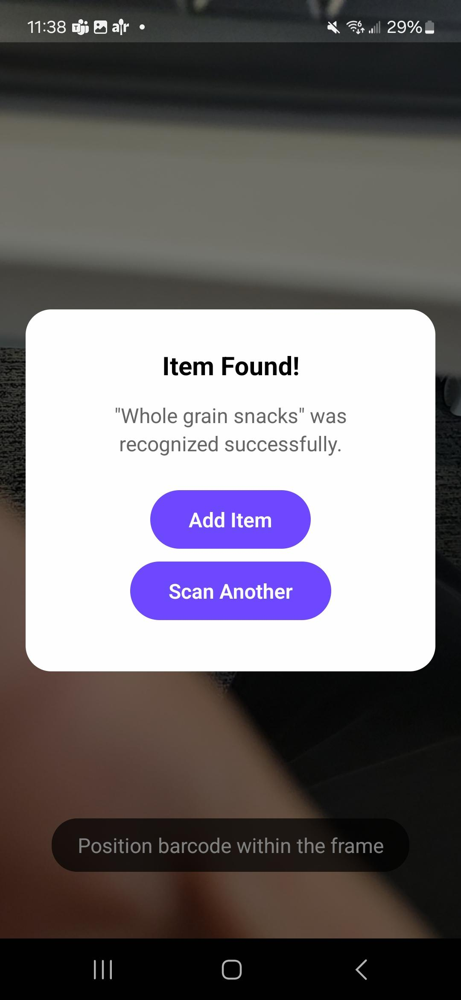

# PantryMe FE

This is a React Native Expo application that allows a user to add/scan items, find prices for those items from local grocery stores, and then convert those to grocery lists.

## Architecture

- **Frontend:** React Native (Expo) with functional components and hooks.
- **Backend:** REST API for item, location, and product data. Rest API is hosted on custom built Node JS server
- **Authentication:** Clerk for secure user management.
- **API Client:** Centralized in `utils/apiClient.ts` for all authenticated API requests.
- **Screens/Pages:** Located in `app/`, organized by feature (auth, public, etc).
- **Components:** Reusable UI components in `components/`.
- **Assets:** Images and fonts in `assets/`.

## Screenshots

Below are some screenshots of the app:

## Getting Started

To run this project locally:

Run on Node version 23

1. **Install dependencies:**
   npm install
2. **Start the Expo development server:**
   npx expo start

3. **Run on your device or emulator:**
   - Use the Expo Go app on your phone to scan the QR code, or
   - Press 'a' to run on Android emulator, 'i' for iOS simulator (Mac only), or 'w' for web.

4. **Environment Variables:**
   - For SSO authentication, provide the .env key EXPO_PUBLIC_CLERK_PUBLISHABLE_KEY from Clerk
   - To connect to the backend for API requests, populate the .env file of BACKEND_URL

5. **Backend:**
   - Make sure the backend REST API is running and accessible at the URL set in the .env file with name BACKEND_URL

For more details, see the Expo documentation: https://docs.expo.dev/

